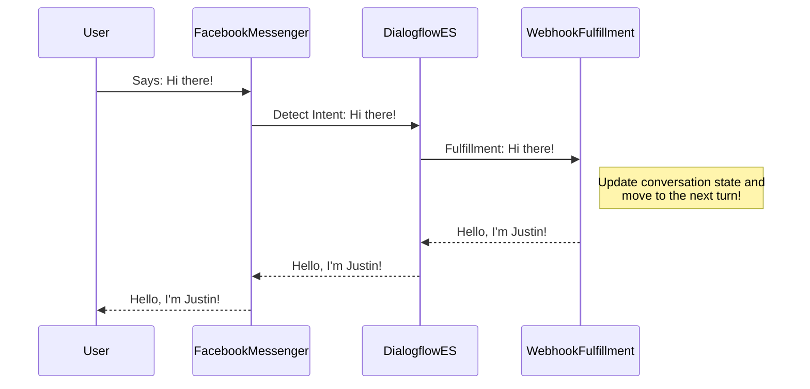

# codingforconvos
I created this NPM library to simplify the journey to success with pro-code conversation management.  Dialogflow ES requires a pro-code solution to managing conversation runtime state effectively.  The initial goal of this project is to make life easier for creating pro-code conversations in Google Dialogflow ES for use with [Dialogflow phone gateway](https://cloud.google.com/dialogflow/es/docs/integrations/phone-gateway) and [Cisco Webex Contact Center](https://www.cisco.com/c/en_ca/products/contact-center/webex-contact-center/index.html).

