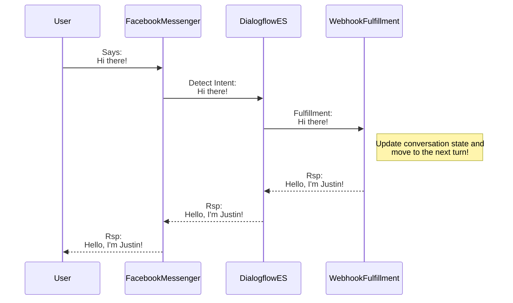

# codingforconvos
I created this NPM library to simplify the journey to success with pro-code conversation management.  Dialogflow ES requires a pro-code solution to managing conversation runtime state effectively.  The initial goal of this project is to make life easier for creating pro-code conversations in Google Dialogflow ES for use with [Dialogflow phone gateway](https://cloud.google.com/dialogflow/es/docs/integrations/phone-gateway) and [Cisco Webex Contact Center](https://www.cisco.com/c/en_ca/products/contact-center/webex-contact-center/index.html).



# Getting Started

Within the [Dialogflow ES Console](https://dialogflow.cloud.google.com), navigate to **Fulfillment**, enable the **In-line Editor**.


Paste the contents of [this template file](https://github.com/jusranda/codingforconvos/blob/main/docs/assets/inline-fulfillment.js) into the *index.js* editor window.

Add the below dependency to the *package.json* editor window.

```
  "dependencies": {
    ...
    "codingforconvos": "^0.0.126",
    ...
  }
```

Click **Deploy**.

# Documentation

The latest javascript documentation can be found [here](https://htmlpreview.github.io/?https://github.com/jusranda/codingforconvos/blob/main/docs/codingforconvos/latest/index.html).