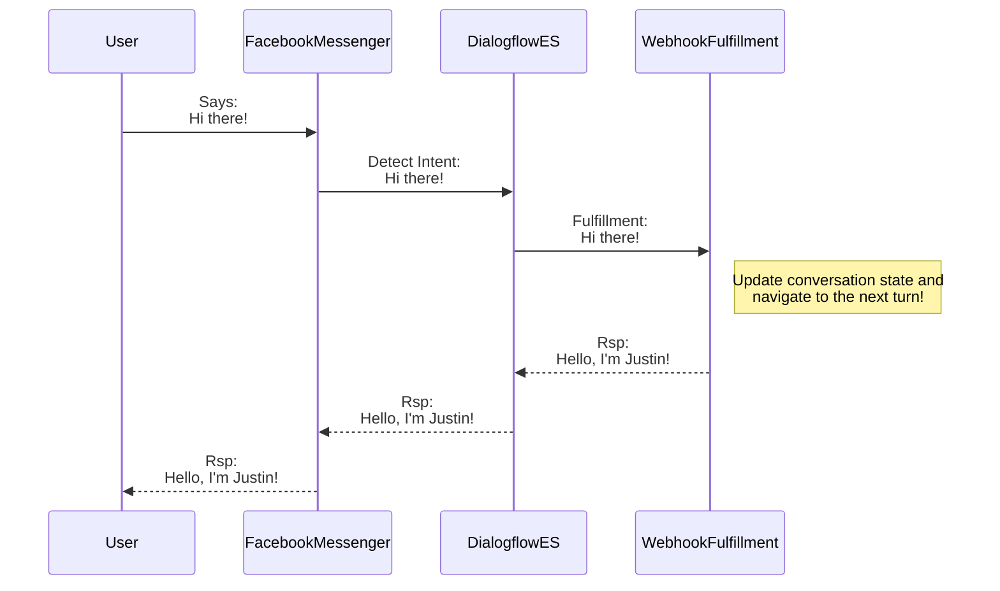

# codingforconvos
I created this NPM library to simplify the journey to success with pro-code conversation management.  Dialogflow ES requires a pro-code solution to managing conversation runtime state effectively.  The initial goal of this project is to make life easier for creating pro-code conversations in Google Dialogflow ES for use with [Dialogflow phone gateway](https://cloud.google.com/dialogflow/es/docs/integrations/phone-gateway) and [Cisco Webex Contact Center](https://www.cisco.com/c/en_ca/products/contact-center/webex-contact-center/index.html).

# Getting Started

Until I have time to adequately document this project, the best way to understand how to use this library is to review projects that implement it:

 - https://github.com/jusranda/codingforconvos-helloworld-dfes (a basic "Hello world" example).
 - https://github.com/jusranda/cctsa-wxccdemobot-fulfillment (a more advanced implementation with various skills, multi-factor-authentication, and more.  this bot is what I used in my Cisco demonstrations on Webex Contact Center).
 - https://github.com/jusranda/cctsa-wxccdemobot-commons (modular skills used by the cctas-wxccdemobot-fulfillment microservice).

# Documentation

The latest javascript documentation can be found [here](https://htmlpreview.github.io/?https://github.com/jusranda/codingforconvos/blob/main/docs/codingforconvos/latest/index.html).

NOTE: Unfortunately, I no longer work for Cisco Systems. and this repository will no longer be maintained - Justin Randall

